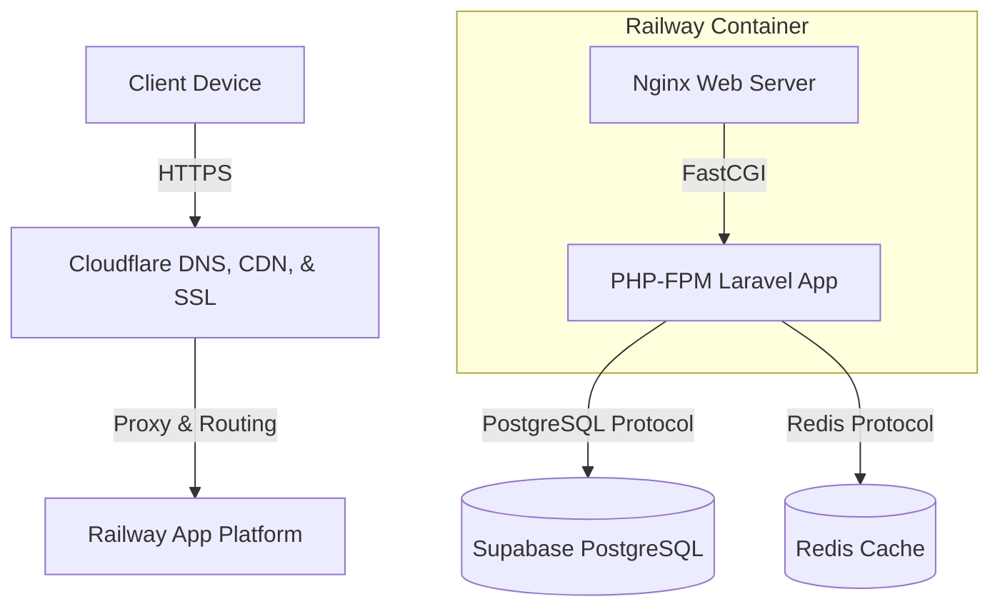

# BAB III
# ANALISIS DAN PERANCANGAN SISTEM (Lanjutan)

## 3.1. Deployment Diagram
*Deployment Diagram* menggambarkan arsitektur fisik dari sistem yang diimplementasikan, meliputi server, node, dan layanan perangkat lunak pendukung. Aplikasi **SisforSinta** mengadopsi arsitektur *cloud-native* yang terdistribusi untuk memastikan ketersediaan tinggi dan kemudahan pemeliharaan.

Berikut adalah topologi deployment dari sistem ini:

1. **Client / Pengguna**: Perangkat (PC, Laptop, atau Smartphone) yang digunakan oleh Guru/Admin untuk mengakses aplikasi melalui web browser.
2. **Cloudflare**: Bertindak sebagai *Domain Name System (DNS) resolver*, *Content Delivery Network (CDN)*, dan penyedia lapisan keamanan SSL (HTTPS) untuk rute domain `siakad-darul-fikri.web.id`.
3. **Railway.app (Application Server)**: Server aplikasi utama berbasis Docker Container. Di dalam *environment* ini berjalan:
   - **Nginx**: Sebagai *Web Server* dan *Reverse Proxy*.
   - **PHP-FPM**: Engine pemroses bahasa PHP yang menjalankan inti aplikasi berbasis *Framework* Laravel.
4. **Supabase (Database Server)**: Layanan *cloud database* eksternal yang menyediakan PostgreSQL untuk menyimpan seluruh data operasional akademik (Data Guru, Siswa, Kelas, Presensi, dan Nilai).
5. **Redis Cloud**: Server memori penyimpanan sementara (*cache*) yang digunakan untuk mempercepat load aplikasi dan memanajemen *session* pengguna.

## 3.2. Rancangan Input
Rancangan input merupakan desain antarmuka yang digunakan oleh pengguna untuk berinteraksi dan memasukkan (entry) data ke dalam sistem basis data. Pada SisforSinta, seluruh form dirancang bersifat responsif dan dilengkapi dengan *server-side validation*.

Adapun rancangan input pada sistem ini meliputi:
1. **Form Login**: Antarmuka untuk proses autentikasi pengguna (Admin/Guru) dengan menginputkan *Username* dan *Password*.
2. **Form Manajemen Data Guru**: Antarmuka bagi Admin untuk meregistrasikan guru baru atau melakukan pembaruan data yang berisi atribut: NIP, Nama Lengkap, Gender, Username, Email, No HP, dan Status (Aktif/Pensiun/Pindah).
3. **Form Manajemen Data Siswa**: Antarmuka untuk mendaftarkan siswa ke sistem. Input yang diperlukan meliputi: NIS, NISN, Nama Siswa, Tanggal Lahir, Alamat, Jenis Kelamin, Kelas Penempatan, Nama Wali, dan No HP Wali.
4. **Form Input Jadwal Pelajaran**: Berupa modal *pop-up* untuk mengatur jadwal mengajar yang menampung data: Mata Pelajaran, Guru Pengampu, Hari, Jam Mulai, dan Jam Selesai.
5. **Form Input Presensi & Sholat**: Antarmuka berbentuk tabel interaktif yang memungkinkan wali kelas menandai kehadiran siswa harian (Hadir, Sakit, Izin, Alpa) dan pelaksanaan ibadah (Sholat Dhuha & Zuhur).
6. **Form Input Nilai**: Antarmuka form tabular yang berfungsi untuk memasukkan hasil penilaian siswa berdasarkan mata pelajaran yang dievaluasi.

## 3.3. Rancangan Output
Rancangan output adalah hasil akhir dari proses pengolahan data oleh sistem yang disajikan kepada pengguna sebagai bahan evaluasi atau informasi. SisforSinta menyajikan output dalam 2 bentuk: *Screen Output* (ditampilkan di layar) dan *Printed Output* (dapat dicetak/diunduh).

Rancangan output yang dihasilkan sistem meliputi:
1. **Dashboard Analytics (Screen Output)**: Dasbor informasi yang menampilkan rekapitulasi data sekolah secara visual dan disesuaikan berdasarkan sesi pengguna yang login. Memuat informasi: Total Siswa Aktif, Total Kelas, Persentase Kehadiran Harian, serta Rincian Jadwal Mengajar Sepekan.
2. **Laporan Data Guru (Printed/PDF/CSV)**: Dokumen rekapitulasi *database* guru lengkap dengan status kepegawaian yang diformat presisi untuk kertas standar A4.
3. **Laporan Data Siswa (Printed/PDF/CSV)**: Dokumen daftar riwayat identitas siswa per kelas. Dokumen ini disesuaikan orientasinya menjadi A4 *Portrait* agar rapi untuk diarsipkan secara fisik.
4. **Rincian Jadwal Pelajaran (Printed/PDF/CSV)**: Dokumen fisik yang memuat rincian alokasi waktu dan pengampu mata pelajaran yang siap cetak untuk didistribusikan ke setiap ruang kelas.
5. **Laporan Rekapitulasi Presensi**: Tabel kumulatif yang merangkum detail presensi kehadiran akademik dan ibadah per periode semester.
6. **Laporan Rekap Nilai Siswa**: Dokumen output *grade* akademik siswa sebagai landasan utama pembuatan rapor semester. 

## 3.5. Implementasi
Tahap implementasi merupakan tahap penerjemahan dari rancangan sistem yang telah dibuat ke dalam bentuk baris kode program (*coding*) hingga sistem siap untuk digunakan dan diuji.

### 3.5.1. Code Generation (Struktur Kode Program)
Sistem Informasi Akademik (SisforSinta) dikembangkan dengan menggunakan pendekatan *Model-View-Controller* (MVC). Implementasi penulisan kode (*Code Generation*) menggunakan teknologi berikut:

1. **Bahasa Pemrograman Utama**: PHP (versi 8+) untuk *backend* logika dan *routing*, serta JavaScript (ES6) untuk interaktivitas pada sisi *frontend*.
2. **Framework Backend**: Laravel (versi 11.x) digunakan sebagai kerangka kerja utama untuk manajemen rute, autentikasi, serta interaksi ke database melalui pemetaan *Object-Relational Mapping* (Eloquent ORM).
3. **Framework Frontend & Styling**: Antarmuka (*User Interface*) dibangun menggunakan Blade Templating dari Laravel, digabungkan dengan **Tailwind CSS** untuk perancangan desain responsif, serta **Alpine.js** untuk manipulasi elemen *Document Object Model* (DOM) yang ringan pada *client-side* (seperti efek *Push Navigation* pada Sidebar menu).
4. **Manajemen Database**: Skema database di-*generate* menggunakan fitur *Migrations* bawaan Laravel yang kemudian dieksekusi (*run*) secara remote ke dalam PostgreSQL di server Supabase.

### 3.5.2. Blackbox Testing
Pengujian sistem dilakukan menggunakan metode *Blackbox Testing*. Pengujian ini berfokus pada fungsionalitas aplikasi dan kecocokan antara input (masukan) dengan output (keluaran) yang dihasilkan tanpa perlu memeriksa struktur internal kode programnya. 

Berikut adalah skenario pengujian utama pada sistem SisforSinta:

| No | Skenario Pengujian | Input | Output yang Diharapkan (Expected) | Hasil / Status |
|:---|:---|:---|:---|:---:|
| 1. | **Autentikasi Login (Valid)** | Memasukkan *Username* dan *Password* yang benar terdaftar di *database*. | Sistem mengarahkan pengguna ke halaman Dashboard sesuai *Role* (Admin/Guru). | ✅ Berhasil |
| 2. | **Autentikasi Login (Invalid)** | Memasukkan *Password* salah atau *Username* fiktif. | Sistem menolak masuk dan menampilkan pesan error peringatan. | ✅ Berhasil |
| 3. | **Hak Akses Manajemen Data** | Login sebagai Guru (Non-Admin) dan mencoba mengakses rute Tambah/Edit/Hapus Data. | Sistem (*Middleware*) langsung menolak akses dengan status terblokir atau menyembunyikan tombol Aksi. | ✅ Berhasil |
| 4. | **Input Data Presensi Siswa** | Menyimpan form tabel kehadiran siswa dengan menandai status Hadir/Sakit/Izin/Alpa. | Data kehadiran tersimpan ke *database* dan statistik grafik Dashboard otomatis diperbarui. | ✅ Berhasil |
| 5. | **Validasi Tambah Jadwal Kelas** | Membiarkan form pengisian Jam Mulai / Jam Selesai Kosong. | Proses penyimpanan dibatalkan dan sistem memunculkan peringatan (Validasi *Required*). | ✅ Berhasil |
| 6. | **Cetak Output (PDF/CSV)** | Menekan tombol "PDF" atau "CSV" pada tabel Data Siswa / Guru / Jadwal. | Browser langsung men-*download* file berisi rekapitulasi data dengan format dokumen yang rapi (Kertas A4). | ✅ Berhasil |

### 3.5.3. Spesifikasi Hardware dan Software
Untuk dapat mengoperasikan dan mengembangkan aplikasi SisforSinta, diperlukan dukungan perangkat keras (*Hardware*) dan perangkat lunak (*Software*) minimum sebagai berikut:

**A. Spesifikasi Server (Production/Deployment)**
Sistem aplikasi telah di-*deploy* ke *environment cloud-hosting* modern dengan kebutuhan komputasi sebagai berikut:
- **Processor:** 1 vCPU (Server Railway)
- **RAM / Memory:** Minimal 512 MB (Direkomendasikan 1 GB)
- **Sistem Operasi:** Linux Base OS (Berjalan di dalam Docker Container)
- **Database Server:** Supabase PostgreSQL Cloud
- **Web Server System:** Nginx HTTP Server dipadukan dengan PHP-FPM
- **Cache / Session Layer:** Redis Cloud (opsional, direkomendasikan untuk stabilitas beban)

**B. Spesifikasi Client (Pengguna / Guru)**
Karena berbasis aplikasi web (*Web-Based Application*), aplikasi tidak membebani komputasi pengguna, namun menuntut prasyarat akses:
- **Sistem Operasi:** Bebas (Windows, macOS, Linux, iOS, atau Android)
- **Web Browser:** Google Chrome, Mozilla Firefox, Safari, atau Microsoft Edge versi terbaru (mendukung HTML5 dan CSS3).
- **Koneksi:** Terhubung dengan jaringan internet yang stabil.
- **Resolusi Minimal:** Responsif untuk smartphone (lebar layar > 360px) hingga dekstop (layar 1366x768 ke atas).

**C. Spesifikasi Lingkungan Pengembang (Development)**
Bagi *programmer* yang akan merawat (*maintenance*) kode, spesifikasi pengembangan (*Development Environment*) yang digunakan saat membangun project ini meliputi:
- **OS PC/Laptop:** Linux (Debian)
- **Text Editor / IDE:** AntiGravity IDE.
- **Environment:** PHP v8.3, Composer (PHP Dependency Manager), Node.js (untuk manajemen aset Tailwind via NPM), dan Git Version Control System.
